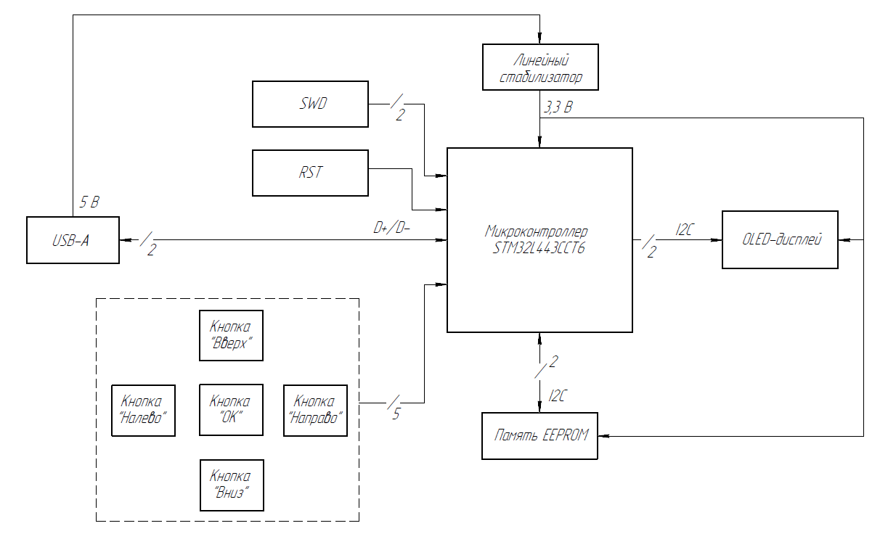
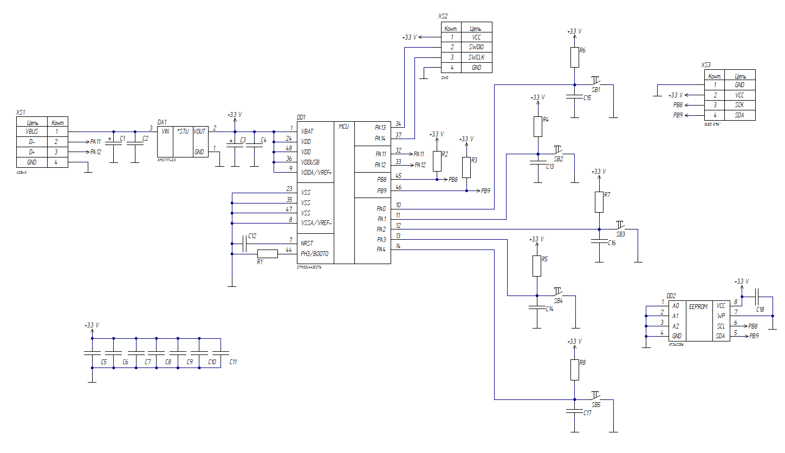

# Аппаратный менеджер паролей
Безопасное локальное хранение учетных данных (логинов и паролей), генерация криптографических ключей и их автоматический ввод в компьютерные системы без использования специализированного ПО или драйверов на стороне ПК.
## Требования к аппаратной платформе
+ *Микроконтроллер:* 32-битный микроконтроллер семейства STM32.
+ *Память:* Внешняя энергонезависимая микросхема памяти EEPROM, 256 Кб.
+ *Устройства вывода:* Графический монохромный OLED-дисплей для отображения пользовательского интерфейса.
+ *Устройства ввода:* Матрица из 5 тактовых механических кнопок для автономной навигации по меню и ввода ПИН-кода.
+ *Интерфейс связи:* Разъем USB.

## Функционал

При подключении к ПК устройство определяется как *USB HID Keyboard* (аппаратная клавиатура) и *USB CDC* (виртуальный COM-порт). При выборе аккаунта менеджер паролей эмулирует нажатия клавиш клавиатуры. Запись новых аккаунтов (шаблонов) в устройство осуществляется с ПК через скрытый COM-порт с помощью вспомогательной утилиты. 

Устройство способно автономно генерировать сложные пароли без участия ПК, используя функцию аппаратной генерации истинно случайных чисел STM32L443CCT6.
Пароли хранятся во внешней EEPROM-памяти в зашифрованном виде (алгоритм шифрования AES-256). Расшифровка базы данных происходит только после ввода пользователем Мастер-ПИН-кода с помощью физических кнопок устройства. Компьютер не имеет доступа к ПИН-коду. Алгоритм отслеживает попытки неверного ввода ПИН-кода. После превышения лимита попыток устройство блокируется по таймеру.

## Функциональная схема устройства

## Принципиальная схема устройства

